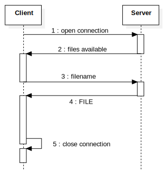

# FileTransfer

[](https://travis-ci.org/Goblin80/FileTransfer)

*FileTransfer.hs* is build on a client-server model architecture written in Haskell.

Using the standard **Transmission Control Protocol** files are transferred between a client and a server on a computer network.

## Build
To build just
```
stack build
```

## Usage

```
FileTransfer [server | client host]
```

## Description

1. *Client* initiate a connection with the server
1. *Server* sends a list of files that are available for transfer.
1. *Client* choose the desired file from the list.
1. *Server* sends that file to *Client*.
1. *Client* saves the received file locally and closes the connection.

